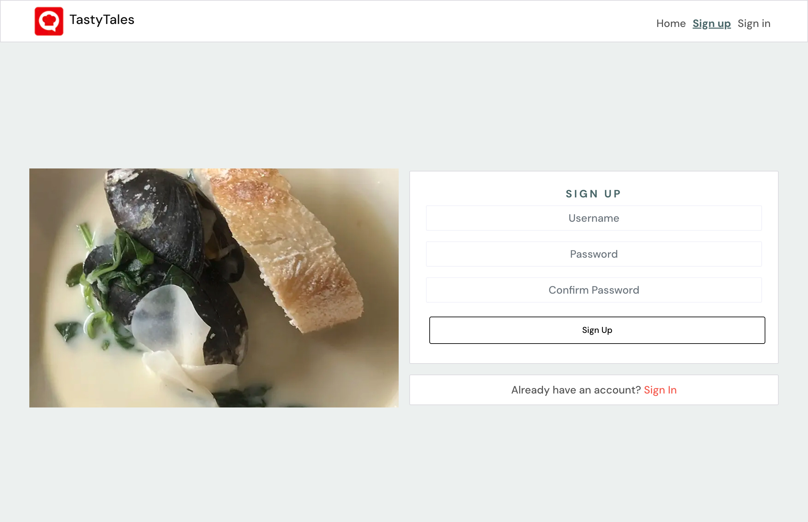

# TastyTales: Where Each Recipe Has Its Own Story

Welcome to **TastyTales**, a platform where every recipe tells a story and every dish becomes a cherished memory. TastyTales is a community-driven recipe-sharing web application built with a React frontend and a Django REST API backend. It’s designed to connect food lovers, home chefs, and culinary adventurers, offering a space to share, discover, and savor recipes from around the world.

Whether you want to showcase your grandmother’s treasured dessert, explore new cuisines, or find inspiration for your next meal, **TastyTales** has something for everyone. Users can create and share their own recipes, comment on and like others' creations, and build meaningful connections through a shared love of food.

Join us in making every recipe a tale worth sharing!


[Visit the TastyTales React App](https://tastytales-83bed5f61a06.herokuapp.com/)

[Explore the TastyTales API](https://tastytales-api-56d55ea68c61.herokuapp.com/)

[View the TastyTales API Repository](https://github.com/behemot-biz/tt-drf)


## Table of Contents

1. [Overview](#overview)
    - [Site Goals](#site-goals)
    - [Key Features](#key-features)
    - [Tech Stack](#tech-stack)
2. [UI/UX Design](#uiux-design)
    - [Overall Design Approach](#overall-design-approach)
    - [Font](#font)
    - [Colors](#colors)
    - [Imagery](#imagery)
    - [Wireframes](#wireframes)
3. [Agile Development](#agile-development)
    - [Kanban Workflow](#kanban-workflow)
    - [User Stories](#user-stories)
    - [Retrospectives](#retrospectives)
4. [Features](#features)
    - [Header, Navigation](#header-navigation)
    - [Start/Home Page](#starthome-page)
    - [Sign-Up Page](#sign-up-page)
    - [Sign-In Page](#sign-in-page)
    - [Add Recipe](#add-recipe)
    - [Recipe Page](#recipe-page)
    - [Edit Recipe](#edit-recipe)
    - [My Cookbook](#my-cookbook)
    - [Recipes Feed](#recipes-feed)
    - [Liked Recipes](#liked-recipes)
    - [Profile Page](#profile-page)
    - [Edit Profile Page](#edit-profile-page)
    - [Change Username Page](#change-username-page)
    - [Change Password Page](#change-password-page)
5. [Testing and Issues](#testing-and-issues)
6. [Technologies Used](#technologies-used)
    - [Work Environments and Hosting](#work-environments-and-hosting)
    - [Languages](#languages)
    - [React Environment and Dependencies](#react-environment-and-dependencies)
    - [Tools and Services](#tools-and-services)
7. [Cloning and Forking](#cloning-and-forking)
    - [Cloning the Repository](#cloning-the-repository)
    - [Forking the Repository](#forking-the-repository)
8. [Setup and Deployment](#setup-and-deployment)
    - [Creating a Heroku Account](#creating-a-heroku-account)
    - [Creating the App](#creating-the-app)
    - [Setting Up Deployment](#setting-up-deployment)
9. [Credits](#credits)
    - [Content](#content)
    - [Thank You](#thank-you)


## Overview

**TastyTales** is a full-stack web application that enables users to share and explore recipes. It allows users to post their own recipes, browse and search for recipes shared by others, and engage through likes and comments. The platform emphasizes creativity and community, giving food enthusiasts a space to showcase their culinary skills.


### Site Goals

The goal of **TastyTales** is to provide an interactive platform for sharing and discovering recipes. Inspired by platforms like Instagram, the site encourages community interaction through features like commenting, liking, and following profiles.


### Key Features
- Search for recipes by name, creator or ingrediens
- Create and edit recipes.
- Manage ingredients efficiently.
- Like and comment on recipes to foster community engagement.
- Follow profiles to explore more content from the chefs you like.

### Tech Stack
1. **Frontend**: Built with React and styled using React Bootstrap for a modern, responsive design.
2. **Backend**: Powered by Django REST API to manage data and interactions seamlessly.


## UI/UX Design

### Overall Design Approach

The design focuses on simplicity and usability. Inspired by storytelling, the interface uses clean layouts and intuitive navigation, ensuring users can focus on recipes and interactions. This approach delivers a consistent experience across devices.

### Font
- **DM Sans**: A modern, sans-serif font used throughout the platform for readability. Earlier experiments with serif fonts for headlines were replaced to keep the focus on content rather than distracting users.

### Colors
The color palette is neutral and minimal, allowing recipe images to take center stage:
- **Baby Powder (#FDEFEC)**: Used for recipe cards and containers.
- **Rich Black (#011627)**: Primary text and buttons.
- **Moss Green (#4A676A)**: Highlights active links.
- **Strawberry Red (#D4311B)**: Logotype, delete buttons, and icons.
- **Neutral Gray (#DADADF)**: Borders and subtle separators.
- **Pale Green (#ECF0EF)**: Background accents.

Two additional shades of green are used sparingly for contrast:
- **#A2B3B0**
- **#3F5056**

### Imagery

High-quality food photography and illustrations inspire users and enhance the storytelling experience. Images are optimized for fast loading without compromising quality.

### Wireframes
Low-fidelity wireframes were created to map out the structure, ensuring intuitive navigation and logical placement of features.

**PETRA --> ADD CONTENT**


## Agile Development

**TastyTales** was developed using agile methodologies, focusing on iterative progress and flexibility. 

[Kanban main board](https://github.com/users/behemot-biz/projects/7/views/1)

[Kanban sprint planning](https://github.com/users/behemot-biz/projects/7/views/2)

### Kanban Workflow
A **Kanban board** was used to track tasks with the following columns:
- **Backlog**: Planned tasks and features.
- **To Do**: Tasks ready to begin.
- **In Progress**: Tasks being worked on.
- **Test**: Completed tasks pending review.
- **Done**: Finished tasks ready for deployment.

### User Stories
Features were planned as user stories to prioritize the end-user perspective. Each story included functionality, acceptance criteria, and priority.

 [See User Stories in TEST.md](TEST.md#user-stories)


### Retrospectives

At the end of each sprint, time was dedicated to reviewing successes, identifying challenges, and discussing areas for improvement. This iterative feedback loop was essential in continuously refining both the development process and the final product.

## Features

### Header, Navigation - Elements Available on All Pages

The **Navigation Bar** ensures a seamless user experience for both authenticated and unauthenticated users. 


<details>
<summary>Features include:</summary>

#### Logged-Out Navigation:
**Menu Options**:
  - Home: Directs users to the homepage with publicly accessible recipes.
  - Sign Up: Allows users to create a new account.
  - Sign In: Redirects users to the login page.

#### Logged-In Navigation:
**Menu Options**:
  - Home: Access to the homepage.
  - Add Recipe: Provides a form to create and submit new recipes.
  - My Cookbook: Displays recipes created by the user.
  - Recipes: Shows recipes from followed chefs.
  - Liked: Redirects to the "Liked Recipes" page for revisiting favorited recipes.
  - Profile Dropdown: Offers access to:
    - Profile Page: Redirects to the user’s profile.
    - Edit Profile: Provides options to update user information.
    - Change Username: Allows the user to update their username.
    - Change Password: Enables password changes.
    - Sign Out: Logs the user out of the application.

The navigation dynamically adapts based on the user’s authentication status, ensuring an intuitive and personalized experience.
</details>

<details>
<summary>Images of Navbar</summary>


<br><br>

<br><br>


</details>


### Start/Home Page

The **Start/Home Page** is the default landing page, showcasing a variety of recipes and engaging community features. 


<details>
<summary>Key elements include:</summary>

**Recipe Feed**:
  - All recipes, sorted on newest are displayed here and are available to all users, displaying:
    - Featured images and recipe titles.
    - A brief description of each recipe.
    - Like and comment counts for social engagement.
    - The author's name, avatar, and post/updated date.

**Search Bar**:
  - A prominent search bar at the top enables users to find recipes quickly by keywords.

**Top Chefs Sidebar**:
  - A list of top chefs is featured on the right-hand side, ranked by follower count.
  - Each entry includes the chef's avatar, username, and a follow/unfollow button for user interaction.

**Edit Option for Recipe Owners**:
  - If a logged-in user is the recipe owner, an edit icon is displayed on their recipe cards, allowing quick updates.

This page serves as a welcoming hub for discovering and interacting with recipes and chefs, catering to both logged-in users and visitors.

</details>

<details>
<summary>Images of page</summary>


</details>


### Sign-Up Page

The **Sign-Up Page** enables new users to create an account seamlessly.


<details>
<summary>Features include:</summary>

**Form Fields**:
  - Username: Allows the user to select a unique identifier for their account.
  - Password: Ensures secure account creation with user input validation.
  - Confirm Password: Validates that the password entered matches the original.

**Design Layout**:
  - The left side of the page features a visually appealing image to enhance the user experience.
  - The form is displayed on the right, ensuring a clean and organized appearance.

**Call-to-Action**:
  - A "Sign Up" button to create the account.
  - A link to the "Sign In" page for users who already have an account.

This page ensures a user-friendly registration process and guides new users through account creation efficiently.

</details>

<details>
<summary>Images of page</summary>



</details>


### Sign-In Page

The **Sign-In Page** allows returning users to access their accounts quickly and securely.

This page offers a simple and efficient login experience while maintaining a visually pleasing layout.

<details>
<summary>Features include:</summary>

**Form Fields**:
  - Username: The user’s unique identifier.
  - Password: Ensures secure login with user input validation.

**Design Layout**:
  - The left side of the page features a high-quality image to enhance visual appeal.
  - The form is displayed on the right, ensuring clarity and ease of use.

**Call-to-Action**:
  - A "Sign In" button to access the user’s account.
  - A link to the "Sign Up" page for new users who need to create an account.

</details>

<details>
<summary>Images of page</summary>


</details>


### Add Recipe

The **Add Recipe** feature allows users to contribute new recipes to the platform through a two-step process.

#### Step 1: Add Recipe Details

<details>
<summary>Features include:</summary>

**Form Fields**:
  - Recipe Name: A field for entering the title of the recipe.
  - Recipe Introduction: A brief description or introduction to the recipe.
  - Cooking Instructions: A detailed guide on how to prepare the dish.

**Image Upload**:
  - Users can upload a featured image for their recipe, with a live preview and a "Change Image" button to update the photo.

**Actions**:
  - "Cancel" button to discard changes.
  - "Add Ingredients" button to proceed to the next step.

</details>

<details>
<summary>Images of page</summary>


</details>

#### Step 2: Add Ingredients and Preview

<details>
<summary>Features include:</summary>

**Ingredient Management**:
  - Users can add ingredients by specifying the quantity, measure, and ingredient name.
  - Options to edit or delete existing ingredients ensure flexibility.

**Recipe Preview**:
- A live preview of the recipe, showcasing:
  - The featured image.
  - Recipe name, introduction, and instructions.
  - An organized list of ingredients.
  - User information (name and avatar) and the current date.

**Actions**:
- "Done, Go to Cookbook" button to save the recipe as a draft and redirect to the "My Cookbook" page for publishing.

This feature ensures that users can seamlessly add and refine recipes while maintaining control over the process.

</details>

<details>
<summary>Images of page</summary>


</details>


### Recipe Page Features include:

#### Big Screen Layout

<details>
<summary>Features include:</summary>

**Recipe Details**:
  - A featured image of the recipe displayed prominently on the left.
  - The recipe title, introduction, and cooking instructions displayed on the right.

  **Ingredients Section**:
  - A list of ingredients needed for the recipe is shown below the image.

**Author Information**:
  - A profile image of the author along with their username and the date the recipe was posted.
  - If the recipe belongs to the logged-in user, an edit option is available for quick updates.

**Interaction Options**:
- Like and comment counts are displayed for quick user interaction.
- A robust comment section at the bottom allows users to share feedback, ask questions, or interact with the recipe author and community members.
- Users can view all comments, reply to existing ones, and add their own thoughts to foster community engagement.
- Each comment displays the commenter’s avatar, username, and the time elapsed since posting.
- A comment section at the bottom allows users to add their thoughts or feedback.

</details>

<details>
<summary>Images of page</summary>


</details>

#### Small Screen Layout

<details>
<summary>Features include:</summary>

**Recipe Details**:
  - The featured recipe image is displayed at the top, followed by the title, introduction, and ingredient list.
  - Tabs allow users to toggle between "Ingredients" and "Instructions" for an optimized mobile experience.

**Author Information**:
  - Similar to the big screen, author details are provided beneath the recipe content.
  - If the recipe belongs to the logged-in user, an edit option is also available.

**Interaction Options**:
  - Like and comment options are positioned prominently to ensure user engagement remains accessible.

**Top Chefs Section**:
  - Displayed below the recipe details.
  - For small screens: Shows the top 4 chefs based on the number of followers.
  - For big screens: Shows the top 5 chefs based on the number of followers.
  - Each chef is displayed with their avatar image, username, and a follow/unfollow button for quick interactions.

This page ensures a seamless and engaging user experience, regardless of the device being used.

</details>

<details>
<summary>Images of page</summary>


</details>

### Edit Recipe

The **Edit Recipe** page allows users to update an existing recipe

<details>
<summary>Features include:</summary>

**Recipe Details**:
  - Input fields for editing the recipe name, introduction, and cooking instructions.
  - A live preview of the recipe image with the option to update it.

**Edit Ingredients**:
  - A list of ingredients with options to:
    - Edit existing ingredients directly.
    - Add new ingredients by specifying the quantity, measure, and type.
    - Delete unwanted ingredients using the provided icons.

**Actions**:
  - "Save" and "Cancel" buttons ensure users can either confirm their updates or discard changes easily.

This page ensures that users can conveniently manage and refine their recipes while maintaining a user-friendly experience.

</details>

<details>
<summary>Images of page</summary>


</details>


### My Cookbook

The **My Cookbook** page provides users with a personalized space to manage their recipes.


<details>
<summary>Features include:</summary>

- Display of all recipes created by the user, shown as recipe cards with the following elements:

**Details**:
  - A featured image for each recipe
  - The recipe title and brief description
  - A label indicating the recipe's status (e.g., 'Published', 'Pending publish')
  - Like and comment counts for quick feedback insights
  - Publish/unpublish options, along with edit and delete icons, for managing each recipe

- Recipes are displayed as organized recipe cards, but filtering or sorting options are not currently implemented.

This page ensures users have full control over their content, providing tools to publish, update, or remove recipes efficiently.

</details>

<details>
<summary>Images of page</summary>


</details>

### Recipes - Feed with Recipes by Followed Chefs

The **Recipes Feed** page showcases recipes posted by chefs that the user follows.

<details>
<summary>Features include:</summary>

**Recipe Cards**:
  - Each recipe is displayed as a card featuring:
    - A featured image of the dish.
    - Recipe title and a brief introduction.
    - Like and comment counts for quick engagement.
    - The author's name and avatar, along with the date the recipe was posted.

**Search Bar**:
  - A search bar at the top allows users to search for specific recipes from the followed chefs.

**Top Chefs Sidebar**:
  - A list of top chefs is displayed on the right, ranked by the number of followers.
  - Each chef is represented with an avatar, username, and follow/unfollow button for easy interaction.

This page allows users to stay updated with the latest creations from their favorite chefs and interact with the community.

</details>

<details>
<summary>Images of page</summary>


</details>

### Liked Recipes

The **Liked Recipes** page displays all the recipes a user has liked, making it easy to revisit favorites.

<details>
<summary>Features include:</summary>

**Recipe Cards**:
  - Each liked recipe is displayed as a card featuring:
    - A featured image of the recipe.
    - Recipe title and a brief introduction.
    - Like and comment counts for quick reference.
    - The author's name and avatar, along with the date the recipe was posted.

**Search Bar**:
  - A search bar at the top allows users to quickly find specific recipes within their liked collection.

**Top Chefs Sidebar**:
  - A list of top chefs is displayed on the right, ranked by the number of followers.
  - Each chef is represented with an avatar, username, and follow/unfollow button for easy interaction.

This page is designed to provide users with a streamlined and enjoyable way to revisit recipes they love while discovering new content through the Top Chefs sidebar.

</details>

<details>
<summary>Images of page</summary>


</details>


### Profile Page

The **Profile** page allows users to view detailed information about a specific chef.


<details>
<summary>Features include:</summary>

**Profile Header**:
  - The chef's avatar image, username, and a follow/unfollow button.
  - A quick overview of the number of recipes posted, followers, and users they are following.
  - A short bio or description provided by the user.

**Recipe Section**:
  - A grid displaying all recipes posted by the chef.
  - Each recipe is displayed as a card containing:
    - A featured image
    - Recipe title and a brief introduction
    - Like and comment counts
    - The date the recipe was posted

**Top Chefs List**:
  - A sidebar highlighting other top chefs with their avatar images and usernames.
  - Follow/unfollow buttons for quick engagement.

This page provides a comprehensive view of the chef's contributions and makes it easy for users to interact with and explore their recipes.

</details>

<details>
<summary>Images of page</summary>


</details>


### Edit Profile Page

The **Edit Profile Page** allows users to update their profile information and profile picture. 


<details>
<summary>Features include:</summary>

**Profile Details**:
  - Input fields for editing the user’s display name and bio.
  - An option to upload a new profile picture, with a preview of the image before saving.

**Actions**:
  - "Cancel" button to discard changes.
  - "Save" button to update profile details and apply changes.

This page provides users with an intuitive way to personalize their profile and keep their information up-to-date.

</details>

<details>
<summary>Images of page</summary>


</details>


### Change Username Page

The **Change Username Page** enables users to update their account username. 


<details>
<summary>Features include:</summary>

**Form Fields**:
  - A single input field for entering the new username.
  - Validation to ensure the username is unique and meets requirements.

**Actions**:
  - "Cancel" button to discard changes and return to the previous page.
  - "Save" button to update the username.

This page ensures that users can easily change their username while maintaining account security.

</details>

<details>
<summary>Images of page</summary>


</details>


### Change Password Page

The **Change Password Page** provides users with the ability to securely update their account password. 

<details>
<summary>Features include:</summary>

**Form Fields**:
  - New Password: An input field for the new password.
  - Confirm Password: A field to re-enter the new password for validation.

**Actions**:
  - "Cancel" button to discard changes and return to the previous page.
  - "Save" button to update the password securely.

This page ensures that users can maintain the security of their accounts by updating passwords with ease.
</details>

<details>
<summary>Images of page</summary>


</details>

## Testing and Issues

Testing information and issues encountered during development are tracked and documented in the respective repositories.

[See the full test documentation -  TEST.md](TEST.md#tastytales-api)


## Technologies Used

### Work Environments and Hosting
- **Photoshop**: Used for graphic editing, logo creation, and image optimization.
- **[GitHub](https://github.com/)**: Version control and project management, including branching strategies and issue tracking.
- **[VSCode](https://code.visualstudio.com/)**: Code editor for writing, testing, and debugging the project.
- **[Heroku](https://heroku.com/)**: Deployment and hosting platform for the live application.

### Languagees Used 
- React with JSX and Modern JavaScript (ES6+)
- CSS stylesheets

### React Environment and Dependencies
This React application was initialized using **Create React App** with a custom template from the [Code Institute repository](https://github.com/Code-Institute-Org/cra-template-moments). 

#### Command Used for Initialization
```bash
npx create-react-app . --template git+https://github.com/Code-Institute-Org/cra-template-moments.git --use-npm
```

#### Template Features
- Predefined project structure.
- Initial configuration of dependencies in `package.json`.

#### Core Frameworks and Libraries
- **Node.js**: `v16.19.1`
- **npm**: `8.19.3`
- **React**: `17.0.2`
- **React DOM**: `17.0.2`
- **React Scripts**: `4.0.3`

#### Additional Libraries and Utilities
- **Routing**: [react-router-dom](https://reactrouter.com/web) (`5.3.4`) for client-side navigation.
- **UI Libraries**: 
  - [Bootstrap](https://getbootstrap.com/) (`4.6.2`) for responsive design.
  - [React Bootstrap](https://react-bootstrap.github.io/) (`1.6.8`) for Bootstrap components in React.
  - [react-infinite-scroll-component](https://www.npmjs.com/package/react-infinite-scroll-component) (`6.1.0`) for infinite scrolling.
- **HTTP Client**: [Axios](https://axios-http.com/) (`0.21.4`) for API communication.
- **Token Management**: [JWT-decode](https://github.com/auth0/jwt-decode) (`3.1.2`) for decoding JWTs.

#### Code Quality Tools
- **Prettier**: (`2.8.4`) for automatic code formatting.
- **ESLint**: (`7.11.0`) for identifying and fixing JavaScript issues.
- **ESLint Plugins**:
  - [eslint-plugin-react](https://github.com/yannickcr/eslint-plugin-react): (`7.21.5`) React-specific linting rules.
  - [eslint-plugin-prettier](https://github.com/prettier/eslint-plugin-prettier): (`3.4.1`) Integrates Prettier into ESLint.
  - [eslint-config-prettier](https://github.com/prettier/eslint-config-prettier): (`6.15.0`) Disables conflicting ESLint rules.
  - [eslint-config-react-app](https://www.npmjs.com/package/eslint-config-react-app): (`6.0.0`) Configurations for Create React App.


#### Tools and Services

<details>
<summary>List of Tools & Services</summary>

<br>

- [Git](https://git-scm.com/): Version control for code collaboration.  
- [GitHub](https://github.com/): Code hosting for repositories and collaboration.  
- [Am I Responsive?](https://ui.dev/amiresponsive): Test website responsiveness across devices.  
- [CSS Validation Service](https://jigsaw.w3.org/css-validator/#validate_by_input): Validate CSS for errors and standards.  
- [Markup Validation Service](https://validator.w3.org/): Validate HTML for compliance and errors.  
- [Lighthouse](https://developer.chrome.com/docs/lighthouse): Website performance and SEO auditing tool.  
- [DevTools](https://developer.chrome.com/docs/devtools): Browser tools for debugging and optimization.  
- [Coolors](https://coolors.co/): Generate and explore color palettes.  
- [Real Favicon Generator](https://realfavicongenerator.net): Create favicon for websites and apps.  
- [Bootstrap Icons](https://icons.getbootstrap.com/): Icon library for web development.  
- [Google Fonts](https://fonts.google.com/): Free fonts for web and print use.  
- [Google Translate Web Page](https://support.google.com/translate/answer/2534559?hl=en&co=GENIE.Platform%3DDesktop): Quick translation of recipes
- [Design.com](https://www.design.com/): Logotype design and branding inspiration.
</details>

## Setup and Deployment

### Cloning the Repository
To clone the repository to your local machine:

1. Visit the [TastyTales GitHub repository](https://github.com/behemot-biz/tastytales).
2. Click the green **"Code"** button.
3. Copy the HTTPS, SSH, or GitHub CLI link provided.
4. Open your terminal and navigate to the desired folder location.
5. Run the following command:
   ```bash
   git clone <repository-link>
   ```
   Replace `<repository-link>` with the copied link.
6. Navigate into the cloned repository:
   ```bash
   cd tastytales
   ```

### Forking the Repository
To fork the repository to your GitHub account:

1. Visit the [TastyTales GitHub repository](https://github.com/behemot-biz/tastytales).
2. Click the **"Fork"** button at the top-right corner of the page.
3. Select your GitHub account as the destination.
4. A forked copy of the repository will appear in your account.

You can now make changes to the forked repository independently. To update your fork with changes from the original repository, use a pull request or the GitHub sync feature.

### Deployment at Heroku
The application is deployed form and hosted on the Heroku platform, enabling seamless deployment and hosting. Below is an overview of the process used:

#### Creating a Heroku Account
1. Visit [Heroku's website](https://www.heroku.com/) and create a free account.
2. Verify your email to activate the account.

#### Creating the App
1. Log in to the Heroku dashboard.
2. Click **"New"** > **"Create New App"**.
3. Choose a unique app name.
4. Select **Europe** as the region to optimize latency for users in the region.
5. Navigate to **settings** and select Add buildpack **nodejs** 

#### Setting Up Deployment
1. Link the app to the GitHub repository:
   - Navigate to the **"Deploy"** tab in the Heroku dashboard.
   - Under **Deployment method**, select **GitHub**.
   - Authorize Heroku to access your GitHub account, if prompted.
   - Search for and connect the appropriate repository.

2. Enable Automatic Deploys (optional):
   - Under **Automatic deploys**, select the branch (e.g., `main`) to deploy changes automatically after every push.

3. Deploy the App:
   - Under **Manual deploy**, select the branch and click **"Deploy Branch"** to build and deploy the app.


## Credits

### Content

This project was primarily developed by following the Moments Walkthrough project from Code Instiute with my own ideas applied on top.

- [React](https://17.reactjs.org/): General documentation for support
- [React Bootstrap](https://react-bootstrap-v4.netlify.app/): General documentation for support
- [Design.com](https://www.design.com/): Inspiration for TastyTales logo

- I had a peak at [Pixavibe Project](https://github.com/JaqiKal/pixavibe-frontend/blob/main/README.md) to make sure I havent missed any importent parts of the README.md documentation.

#### Borrowed Images and Recipes

- [Lilac cordial](https://www.ica.se/recept/syrensaft-728138/?referrer=#pfset=1)
- [Apple filled butter buns](https://alltommat.expressen.se/recept/appelfyllda-smorbullar-med-kanelsocker/)
- [Tomato sauce](https://www.ica.se/recept/tomatsas-grundrecept-722161/)
- [Pizza Dough](https://www.ica.se/recept/pizzadeg-258023/)
- [Hasselback potatoes](https://www.ica.se/recept/hasselbackspotatis-3679/)
- [Scones](https://www.ica.se/recept/scones-690203/)
- [Bearnaise sauce](https://www.ica.se/artikel/egen-bearnaisesas/)
- [Plum marmalade](https://www.dansukker.se/se/recept/plommonmarmelad)
- [Strawberry jam with frozen berries](https://www.dansukker.se/se/recept/jordgubbssylt-med-frysta-bar)
- [Tomato jam](https://www.dansukker.se/se/recept/tomatmarmelad)

### Thank You
- A Big thank you to CI's cohort facilitator Kay Welfare and to mentor Rohit Sharma for the support and help along the way
- My friends and family for the tests, patience and support
- The slack community and mainly the Swedish Channel.


