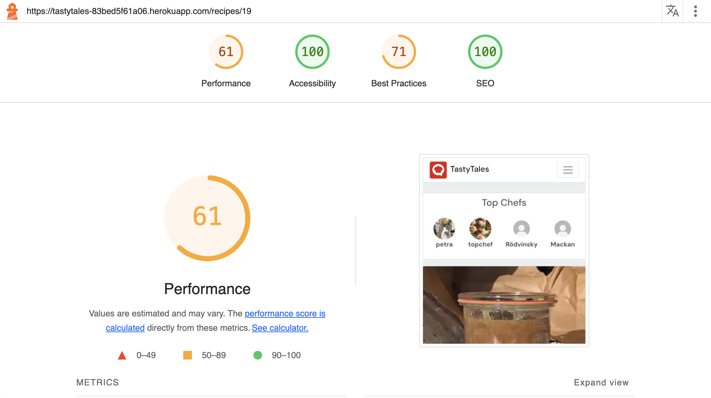

# TESTS TastyTales Front and Backend
**PETRA --> ADD AND EDIT CONTENT START**
 

[Live site - TastyTales React App](https://tastytales-83bed5f61a06.herokuapp.com/)

[TastyTales React App Repository](#https://github.com/behemot-biz/tastytales).

[Live site - TastyTales API](https://tastytales-api-56d55ea68c61.herokuapp.com/)

[TastyTales API Repository](https://github.com/behemot-biz/tt-drf)

### User Stories
The userstories applies to borh front and backend. 

| No. | User Story                                                                                       | Implemented |
|--------|--------------------------------------------------------------------------------------------------|-------------|
| 1      | As a user, I want to see a navigation bar at the top of the site so that I can easily access different parts of the platform. | Yes/No      |
| 2      | As a user, I want to register for a new account through a form so that I can access the platform’s features. | Yes/No      |
| 3      | As a user, I want to log in through a form so that I can access my account.                      | Yes/No      |
| 4      | As a user, I want to log out so that I can securely end my session.                              | Yes/No      |
| 5      | As a user, I want to see feedback messages when logging in or registering (e.g., success, error messages). | Yes/No      |
| 6      | As a user, I want to see a list of recipes so that I can browse content shared by others.        | Yes/No      |
| 7      | As a user, I want to click on a recipe to view its detailed page.                                | Yes/No      |
| 8      | As a user, I want to see detailed information about a single recipe so that I can learn how to make it. | Yes/No      |
| 9      | As a user, I want to see comments on the recipe so that I can read what others think.            | Yes/No      |
| 10     | As a user, I want to fill out a form to create a new recipe so that I can share my cooking ideas. | Yes/No      |
| 11     | Implement form validation to ensure that required fields are filled and data is in the correct format. | Yes/No      |
| 12     | Provide user feedback on successful or failed recipe creation.                                   | Yes/No      |
| 13     | As a user, I want to edit a recipe I created so that I can update its details.                   | Yes/No      |
| 14     | As a user, I want to delete a recipe I created so that I can remove content I no longer wish to share. | Yes/No      |
| 15     | As a user, I want to add a comment on a recipe so that I can share my feedback or ask questions. | Yes/No      |
| 16     | As a user, I want to edit a comment I made so that I can update or correct my input.             | Yes/No      |
| 17     | As a user, I want to delete a comment I made so that I can remove it.                            | Yes/No      |
| 18     | As a user, I want to search for recipes by title or tags so that I can quickly find relevant content. | Yes/No      |
| 19     | As a user, I want to filter recipes by category (e.g., vegan, dessert) so that I can narrow down my options. | Yes/No      |
| 20     | As a user, I want to view my profile with my created recipes and comments.                       | Yes/No      |
| 21     | As a user, I want to update my profile information (e.g., profile picture, bio).                 | Yes/No      |

## TastyTales 
**PETRA --> ADD AND EDIT CONTENT START**

### Lighthouse 

Start page not logged in

Start page

Recipe page not logged in

Recipe page

Add recipe 1 of 2

Add recipe 2 of 2

Edit recipe

My cookbook

Recipes feed

Liked recipes

Profile page not logged in 

Profile page

Sign in page

Sign up page

#### Mobile Device

Start page not logged in

Start page

Recipe page not logged in

Recipe page

Add recipe 1 of 2

Add recipe 2 of 2

Edit Recipe

My cookbook

Recipes feed

Liked recipes

Profile page not logged in

Profile page

#### Accessibility Improvements

As part of ensuring better usability and accessibility for all users, Chrome Developer Tools flagged certain improvements related to form elements. While these improvements do not affect the current functionality of the application, they highlight opportunities to enhance accessibility and compliance with best practices.

Read more

#### Suggestions:
1. **Unique `id` Attributes for Form Fields**  
   Chrome DevTools suggested that form fields should have unique `id` attributes. This helps associate `<label>` elements with the corresponding input fields more effectively, which is particularly beneficial for assistive technologies like screen readers.

2. **Labels Associated with Form Fields**  
   It was recommended to associate `<label>` elements with form fields using the `for` attribute and a matching `id`. This improves accessibility by providing clear input field descriptions for users relying on screen readers.

#### Current Implementation:
- The application dynamically renders input fields (e.g., for adding or editing ingredients). Each input field is assigned a unique `id` at runtime using the component's state and logic.
- However, Chrome DevTools occasionally suggests these improvements because dynamic IDs and their association with labels can sometimes appear unclear during rendering.

#### Future Plans:
These accessibility suggestions will be reviewed in future updates to further improve usability and compliance:
- Ensure all dynamically generated input fields have consistently unique `id` values.
- Confirm that all `<label>` elements reference the correct `id` using the `for` attribute.

#### Why Not Addressed Immediately:
- The current implementation does not break functionality or usability.
- Addressing this improvement requires significant changes to the rendering logic for dynamic components, which is not critical at this stage.

By documenting these suggestions, I acknowledge the improvements while focusing on maintaining a functional and efficient user experience.

### CSS Validation
All CSS files passed validation 

App.module.css

Avatar.module.css

Button.module.css

Comment.module.css

CommentCreateEditForm.module.css

Ingredient.module.css

IngredientManager.module.css

NavBar.module.css

NotFound.module.css

PopularProfiles.module.css

Profile.module.css

ProfilePage.module.css

Recipe.module.css

RecipeCard.module.css

RecipeCreateEditForm.module.css

RecipesPage.module.css

SignInUpForm.module.css

### HTML Validation

Start

Sign Up

Sign In

Recipe Feed

Profile Page

My Cookbook

Liked Recipes

Edit Recipe

Edit Profile

Change Username

Change Password

Add Recipe

Add Ingredients

### Manual Tests

#### Test environment - Manual tests

The test cases were carried out on following devices/browsers: 

MacBook Pro 15-inch, 2017
- Safari Version 17.4.1 
- Firefox 124.0.2 (64-bit)
- Chrome Version 123.0.6312.124 (Official Build) (x86_64)

Ipad pro (12,9 inch IOS 16.7.7)
- Safari
- Firefox
- Chrome 

Iphone SE
- Safari
- Chrome 

Iphone 8 plus (IOS 16.7.7)
- Safari

Text on using the site on iphone, settings due to ...

#### Test Cases

| Test Case # | User Story                                              | Expected Outcome                                                                   | Pass/Fail |
|-------------|---------------------------------------------------------|-----------------------------------------------------------------------------------|-----------|
| 1           | As a user, I want to see a navigation bar at the top of the site so that I can easily access different parts of the platform. | The navigation bar is visible on all pages and links to key parts of the platform. |           |
| 2           | As a user, I want to register for a new account through a form so that I can access the platform’s features. | The user can register successfully with valid inputs.                             |           |
| 3           | As a user, I want to log in through a form so that I can access my account. | The user can log in successfully with correct credentials.                        |           |
| 4           | As a user, I want to log out so that I can securely end my session. | The user is logged out and redirected to the login or homepage.                   |           |
| 5           | As a user, I want to see feedback messages when logging in or registering (e.g., success, error messages). | Feedback messages are displayed for login/registration attempts.                 |           |
| 6           | As a user, I want to see a list of recipes so that I can browse content shared by others. | The recipe list page displays recipes shared by other users.                      |           |
| 7           | As a user, I want to click on a recipe to view its detailed page. | Clicking on a recipe navigates to its detail page.                                |           |
| 8           | As a user, I want to see detailed information about a single recipe so that I can learn how to make it. | The recipe detail page displays the full recipe, including ingredients and steps. |           |
| 9           | As a user, I want to see comments on the recipe so that I can read what others think. | Comments are displayed below the recipe details.                                  |           |
| 10          | As a user, I want to fill out a form to create a new recipe so that I can share my cooking ideas. | The user can submit a new recipe form, and it appears on the platform.            |           |
| 11          | As a user, I want to edit a recipe I created so that I can update its details. | The user can successfully edit and save changes to their recipe.                  |           |
| 12          | As a user, I want to delete a recipe I created so that I can remove content I no longer wish to share. | The user can delete their recipe, and it is removed from the platform.            |           |
| 13          | As a user, I want to add a comment on a recipe so that I can share my feedback or ask questions. | The user can post comments, and they are displayed under the recipe.              |           |
| 14          | As a user, I want to edit a comment I made so that I can update or correct my input. | The user can edit their comment, and the changes are saved.                       |           |
| 15          | As a user, I want to delete a comment I made so that I can remove it. | The user can delete their comment, and it no longer appears on the recipe page.   |           |
| 16          | As a user, I want to search for recipes by title or tags so that I can quickly find relevant content. | The search bar filters recipes based on entered keywords or tags.                 |           |
| 17          | As a user, I want to filter recipes by category (e.g., vegan, dessert) so that I can narrow down my options. | The user can apply category filters, and only relevant recipes are displayed.     |           |
| 18          | As a user, I want to view my profile with my created recipes and comments. | The user profile page displays their created recipes and comments.                |           |
| 19          | As a user, I want to update my profile information (e.g., profile picture, bio). | The user can edit and save changes to their profile information.                  |           |

| x1          | Implement form validation to ensure that required fields are filled and data is in the correct format. | Invalid submissions are prevented, and appropriate error messages are shown.      |           |
| x2          | Provide user feedback on successful or failed recipe creation. | Success or error messages are displayed after form submission.                    |           |

## TastyTales API

### PEP8 validation
All files passed PEP8 validation
#### Comments

models.py

serializer.py

tests.py

urls.py

views.py

#### Followers

models.py

serializers.py

urls.py

views.py

#### Likes

models.py

serializers.py

urls.py

views.py

#### Profiles

models.py

serializers.py

urls.py

views.py

#### Recipes

filters.py

models.py

serializers.py

tests.py

urls.py

views.py

### Manual Tests

| Test Case # | User Story                                              | Expected Outcome                                                                   | Pass/Fail |
|-------------|---------------------------------------------------------|-----------------------------------------------------------------------------------|-----------|
| 1           | As a user, I want to log in through a form so that I can access my account. | The user can log in successfully with correct credentials.                        |           |
| 2           | As a user, I want to log out so that I can securely end my session. | The user is logged out and redirected to the login or homepage.                   |           |
| 3           | As a user, I want to see a list of recipes so that I can browse content shared by others. | The recipe list page displays recipes shared by other users.                      |           |
| 4           | As a user, I want to click on a recipe to view its detailed page. | Clicking on a recipe navigates to its detail page.                                |           |
| 5           | As a user, I want to see detailed information about a single recipe so that I can learn how to make it. | The recipe detail page displays the full recipe, including ingredients and steps. |           |
| 6           | As a user, I want to see comments on the recipe so that I can read what others think. | Comments are displayed below the recipe details.                                  |           |
| 7           | As a user, I want to fill out a form to create a new recipe so that I can share my cooking ideas. | The user can submit a new recipe form, and it appears on the platform.            |           |
| 8           | As a user, I want to edit a recipe I created so that I can update its details. | The user can successfully edit and save changes to their recipe.                  |           |
| 9           | As a user, I want to delete a recipe I created so that I can remove content I no longer wish to share. | The user can delete their recipe, and it is removed from the platform.            |           |
| 10          | As a user, I want to add a comment on a recipe so that I can share my feedback or ask questions. | The user can post comments, and they are displayed under the recipe.              |           |
| 11          | As a user, I want to edit a comment I made so that I can update or correct my input. | The user can edit their comment, and the changes are saved.                       |           |
| 12          | As a user, I want to delete a comment I made so that I can remove it. | The user can delete their comment, and it no longer appears on the recipe page.   |           |
| 13          | As a user, I want to search for recipes by title or tags so that I can quickly find relevant content. | The search bar filters recipes based on entered keywords or tags.                 |           |

The manual tests were caried out in the DRF UI 

### Automatic tests 
#### Recipes - All Passed
| Test Case # | Test Description                                             | Expected Outcome                                                                                     |
|-------------|--------------------------------------------------------------|-----------------------------------------------------------------------------------------------------|
| 1           | Ensure all recipes are listed via the API.                   | The API returns a list of all recipes with a 200 OK status.                                         |
| 2           | Test recipe creation by a logged-in user.                    | A logged-in user successfully creates a recipe, resulting in a 201 Created status.                  |
| 3           | Test that an unauthenticated user cannot create a recipe.    | The API denies recipe creation for unauthenticated users with a 403 Forbidden status.               |
| 4           | Search for recipes by ingredient.                            | Recipes containing the searched ingredient are returned with a 200 OK status.                       |
| 5           | Ensure 'pending_publish' recipes are visible to the owner.   | Recipes with 'pending_publish' status are listed for the owner with a 200 OK status.                |
| 6           | Ensure 'pending_publish' recipes are hidden from others.     | Recipes with 'pending_publish' status are not listed for other users, returning an empty result set. |
| 7           | Ensure 'pending_delete' recipes are visible to the owner.    | Recipes with 'pending_delete' status are listed for the owner with a 200 OK status.                 |
| 8           | Ensure 'pending_delete' recipes are hidden from others.      | Recipes with 'pending_delete' status are not listed for other users.                                |
| 9           | Retrieve a recipe by its ID.                                 | The API returns the recipe details with a 200 OK status.                                            |
| 10          | Allow logged-in users to update their own recipes.           | A logged-in user updates their recipe successfully with a 200 OK status.                            |
| 11          | Prevent users from updating others' recipes.                 | The API denies update attempts on others' recipes with a 403 Forbidden status.                      |
| 12          | Allow logged-in users to delete their own recipes.           | A logged-in user deletes their recipe successfully with a 204 No Content status.                    |
| 13          | Prevent users from deleting others' recipes.                 | The API denies delete attempts on others' recipes with a 403 Forbidden status.                      |
| 14          | Allow users to add ingredients to their recipes.             | Ingredients are added successfully to the user's recipe with a 201 Created status.                  |
| 15          | Prevent users from adding ingredients to others' recipes.    | The API denies ingredient additions to others' recipes with a 400 Bad Request status.               |
| 16          | Allow users to delete ingredients from their recipes.        | Ingredients are removed successfully from the user's recipe with a 204 No Content status.           |

Coverage Report - Recipes

#### Comments -- All Passed

| Test Case # | Test Description                                               | Expected Outcome                                                                                     |
|-------------|----------------------------------------------------------------|-----------------------------------------------------------------------------------------------------|
| 1           | Ensure all comments are listed via the API.                    | The API returns a list of comments with a 200 OK status.                                            |
| 2           | Test comment creation by an authenticated user.                | An authenticated user successfully creates a comment with a 201 Created status.                     |
| 3           | Test that an unauthenticated user cannot create a comment.     | The API denies comment creation for unauthenticated users with a 403 Forbidden status.              |
| 4           | Retrieve a single comment by its ID.                           | The API returns the comment details with a 200 OK status.                                           |
| 5           | Allow comment owners to update their comments.                 | The owner successfully updates their comment with a 200 OK status.                                  |
| 6           | Prevent users from updating others' comments.                  | The API denies update attempts on others' comments with a 403 Forbidden status.                     |
| 7           | Allow comment owners to delete their comments.                 | The owner successfully deletes their comment with a 204 No Content status.                          |
| 8           | Prevent users from deleting others' comments.                  | The API denies delete attempts on others' comments with a 403 Forbidden status.                     |

Coverage Report - Comments

