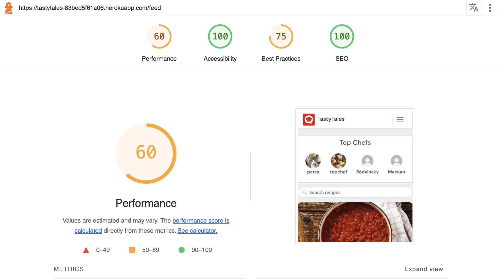

# TESTS TastyTales Front and Backend

### Table of Contents

1. [Introduction](#introduction)  

2. [Live Sites and Repositories](#live-sites-and-repositories)  
   2.1 [Live Site - TastyTales React App](#live-site---tastytales-react-app)  
   2.2 [TastyTales React App Repository](#tastytales-react-app-repository)  
   2.3 [Live Site - TastyTales API](#live-site---tastytales-api)  
   2.4 [TastyTales API Repository](#tastytales-api-repository)  

3. [User Stories](#user-stories)  

4. [Frontend Testing](#frontend-testing)  
   4.1 [JavaScript Validation](#javascript-validation)  
   4.2 [Lighthouse Reports](#lighthouse-reports)  
       - [Desktop](#desktop)  
       - [Mobile Device](#mobile-device)  
   4.3 [Accessibility Improvements](#accessibility-improvements)  
   4.4 [CSS Validation](#css-validation)  
   4.5 [HTML Validation](#html-validation)  

5. [Manual Testing](#manual-testing)  
   5.1 [Navigation](#navigation)  
   5.2 [Recipes](#recipes)  
       - [Viewing Recipes](#viewing-recipes)  
       - [Adding Recipes](#adding-recipes)  
       - [Editing Recipes](#editing-recipes)  
       - [Deleting Recipes](#deleting-recipes)  
   5.3 [Comments](#comments)  
       - [Adding Comments](#adding-comments)  
       - [Editing Comments](#editing-comments)  
       - [Deleting Comments](#deleting-comments)  
   5.4 [My Cookbook](#my-cookbook)  
       - [Viewing My Cookbook](#viewing-my-cookbook)  
       - [Publishing Recipes](#publishing-recipes)  
       - [Deleting Recipes](#deleting-recipes-1)  
   5.5 [Likes](#likes)  
   5.6 [Follow/Unfollow Users](#followunfollow-users)  
       - [From Profile Page](#from-profile-page)  
       - [From Top Chefs Section](#from-top-chefs-section)  
   5.7 [Search](#search)  

6. [Backend Testing](#backend-testing)  
   6.1 [PEP8 Validation](#pep8-validation)  
       - [Comments](#comments-1)  
       - [Followers](#followers)  
       - [Likes](#likes-1)  
       - [Profiles](#profiles)  
       - [Recipes](#recipes-1)  
   6.2 [Manual API Testing](#manual-api-testing)  
       - [Testing Process](#testing-process)  
       - [Test Results](#test-results)  

7. [Automated Testing](#automated-testing)  
   7.1 [Recipes Tests](#recipes-tests)  
       - [Coverage Report - Recipes](#coverage-report---recipes)  
   7.2 [Comments Tests](#comments-tests)  
       - [Coverage Report - Comments](#coverage-report---comments)  
 ## Introduction

This section documents the testing process undertaken for the **TastyTales** project, which includes both the frontend (React) and backend (Django REST Framework). Testing was an essential part of ensuring that the application delivers a robust, accessible, and user-friendly experience across devices and platforms.

The testing strategy involved a combination of **manual tests**, **automatic tests**, and **validation checks** to ensure the application meets functional, usability, and coding standards. The tests were conducted on various features such as navigation, recipe management, user interactions (e.g., likes, follows, and comments), and API endpoints.

Key testing components include:

- **Manual Testing**: Simulating user actions on the site to validate the proper functioning of core features, such as navigation, recipe creation, editing, and deletion.
- **Lighthouse Reports**: Evaluating the performance, accessibility, best practices, and SEO for both desktop and mobile views.
- **CSS and HTML Validation**: Ensuring the code adheres to web standards for styling and structure.
- **PEP8 Validation**: Verifying Python code compliance with PEP8 standards for readability and maintainability.
- **API Testing**: Assessing the correctness of backend endpoints using Django REST Framework's UI for both authenticated and unauthenticated scenarios.
- **Automated Tests**: Writing unit tests for critical functionality in both frontend and backend components, with coverage reports to confirm testing completeness.

This rigorous testing ensures the **TastyTales** application is reliable, user-friendly, and accessible to a broad audience.

[Live site - TastyTales React App](https://tastytales-83bed5f61a06.herokuapp.com/)

[TastyTales React App Repository](#https://github.com/behemot-biz/tastytales).

[Live site - TastyTales API](https://tastytales-api-56d55ea68c61.herokuapp.com/)

[TastyTales API Repository](https://github.com/behemot-biz/tt-drf)

### User Stories
The userstories applies to both front and backend. 

User Stories

| No. | User Story                                                                                       | Implemented |
|--------|--------------------------------------------------------------------------------------------------|-------------|
| 1      | As a user, I want to see a navigation bar at the top of the site so that I can easily access different parts of the platform. | Yes/No      |
| 2      | As a user, I want to register for a new account through a form so that I can access the platform’s features. | Yes/No      |
| 3      | As a user, I want to log in through a form so that I can access my account.                      | Yes/No      |
| 4      | As a user, I want to log out so that I can securely end my session.                              | Yes/No      |
| 5      | As a user, I want to see feedback messages when logging in or registering (e.g., success, error messages). | Yes/No      |
| 6      | As a user, I want to see a list of recipes so that I can browse content shared by others.        | Yes/No      |
| 7      | As a user, I want to click on a recipe to view its detailed page.                                | Yes/No      |
| 8      | As a user, I want to see detailed information about a single recipe so that I can learn how to make it. | Yes/No      |
| 9      | As a user, I want to see comments on the recipe so that I can read what others think.            | Yes/No      |
| 10     | As a user, I want to fill out a form to create a new recipe so that I can share my cooking ideas. | Yes/No      |
| 11     | Implement form validation to ensure that required fields are filled and data is in the correct format. | Yes/No      |
| 12     | Provide user feedback on successful or failed recipe creation.                                   | Yes/No      |
| 13     | As a user, I want to edit a recipe I created so that I can update its details.                   | Yes/No      |
| 14     | As a user, I want to delete a recipe I created so that I can remove content I no longer wish to share. | Yes/No      |
| 15     | As a user, I want to add a comment on a recipe so that I can share my feedback or ask questions. | Yes/No      |
| 16     | As a user, I want to edit a comment I made so that I can update or correct my input.             | Yes/No      |
| 17     | As a user, I want to delete a comment I made so that I can remove it.                            | Yes/No      |
| 18     | As a user, I want to search for recipes by title or tags so that I can quickly find relevant content. | Yes/No      |
| 19     | As a user, I want to filter recipes by category (e.g., vegan, dessert) so that I can narrow down my options. | Yes/No      |
| 20     | As a user, I want to view my profile with my created recipes and comments.                       | Yes/No      |
| 21     | As a user, I want to update my profile information (e.g., profile picture, bio).                 | Yes/No      |

## TastyTales Frontend

### React JavaScript
No errors reported by Eslint

### Lighthouse 

#### Desktop

Start page not logged in

Start page

Recipe page not logged in

Recipe page

Add recipe 1 of 2

Add recipe 2 of 2

Edit recipe

My cookbook

Recipes feed

Liked recipes

Profile page not logged in 

Profile page

Sign in page

Sign up page

#### Mobile Device

Start page not logged in

Start page

Recipe page not logged in

Recipe page

Add recipe 1 of 2

Add recipe 2 of 2

Edit Recipe

My cookbook

Recipes feed

Liked recipes

Profile page not logged in

Profile page

#### Accessibility Improvements

As part of ensuring better usability and accessibility for all users, Chrome Developer Tools flagged certain improvements related to form elements. While these improvements do not affect the current functionality of the application, they highlight opportunities to enhance accessibility and compliance with best practices.

Read more

#### Suggestions:
1. **Unique `id` Attributes for Form Fields**  
   Chrome DevTools suggested that form fields should have unique `id` attributes. This helps associate `<label>` elements with the corresponding input fields more effectively, which is particularly beneficial for assistive technologies like screen readers.

2. **Labels Associated with Form Fields**  
   It was recommended to associate `<label>` elements with form fields using the `for` attribute and a matching `id`. This improves accessibility by providing clear input field descriptions for users relying on screen readers.

#### Current Implementation:
- The application dynamically renders input fields (e.g., for adding or editing ingredients). Each input field is assigned a unique `id` at runtime using the component's state and logic.
- However, Chrome DevTools occasionally suggests these improvements because dynamic IDs and their association with labels can sometimes appear unclear during rendering.

#### Future Plans:
These accessibility suggestions will be reviewed in future updates to further improve usability and compliance:
- Ensure all dynamically generated input fields have consistently unique `id` values.
- Confirm that all `<label>` elements reference the correct `id` using the `for` attribute.

#### Why Not Addressed Immediately:
- The current implementation does not break functionality or usability.
- Addressing this improvement requires significant changes to the rendering logic for dynamic components, which is not critical at this stage.

By documenting these suggestions, I acknowledge the improvements while focusing on maintaining a functional and efficient user experience.

### CSS Validation
All CSS files passed validation 

App.module.css

Avatar.module.css

Button.module.css

Comment.module.css

CommentCreateEditForm.module.css

Ingredient.module.css

IngredientManager.module.css

NavBar.module.css

NotFound.module.css

PopularProfiles.module.css

Profile.module.css

ProfilePage.module.css

Recipe.module.css

RecipeCard.module.css

RecipeCreateEditForm.module.css

RecipesPage.module.css

SignInUpForm.module.css

### HTML Validation
All pages passed HTML validation. Info displayed about trailingslash on void elements. The full set of messages are visible on the first screenshot below (start)
In the rest of the screenshots the messages are hidden using message filtering option.

Start

Sign Up

Sign In

Recipe Feed

Profile Page

My Cookbook

Liked Recipes

Edit Recipe

Edit Profile

Change Username

Change Password

Add Recipe

Add Ingredients

### Manual Tests

#### Test environment - Manual tests

The test cases were carried out on following devices/browsers: 

MacBook Pro 15-inch, 2017
- Safari Version 17.4.1 
- Firefox 124.0.2 (64-bit)
- Chrome Version 123.0.6312.124 (Official Build) (x86_64)

Ipad pro (12,9 inch IOS 16.7.7)
- Safari
- Firefox
- Chrome 

Iphone SE
- Safari
- Chrome 

Iphone 8 plus (IOS 16.7.7)
- Safari

Text on using the site on iphone, settings due to ...

### Navigation

The navigation bar at the top allows access to all key features of the platform. It adapts for smaller screens using a dropdown menu.

| Feature | Action                             | Expected Result                 | Status |
| ----- | ---------------------------------| ------------------------------| -----|
| **Logo** | While not on the homepage, click the **TastyTales** logo. | The user is redirected to the homepage. | Pass |
| **Home Link** | While not on the homepage, click the **TastyTales** logo. | The user is redirected to the homepage. | Pass |
| **"Recipes" Link** | While authenticated, click "Recipes" in the navigation bar. | The user is directed to the Recipes feed page. | Pass |
| **"My Cookbook" Link** | While authenticated, click "My Cookbook". | The user is directed to the My Cookbook page displaying their recipes. | Pass |
| **"Liked Recipes" Link** | While authenticated, click "Liked Recipes". | The user is directed to the Liked Recipes page. | Pass |
| **"Add Recipe" Link** | While authenticated, click "Add Recipe". | The user is directed to the Add Recipe page. | Pass |
| **"Avatar" Link** | While authenticated, click on "username". | Dropdown menu is displayed with profile related links  | Pass |
| **"Profile page" Link** | While authenticated, click "Profile Page". | The user is directed to profile page. | Pass |
| **"Edit Profile" Link** | While authenticated, click "Edit Profile". | The user is directed to edit profile page. | Pass |
| **"Change Username" Link** | While authenticated, click "Change username". | The user is directed to change username page. | Pass |
| **"Change Password" Link** | While authenticated, click "Change password". | The user is directed to change password page. | Pass |
| **"Sign out" Link** | While authenticated, click "Sign out". | The user is logged out and redirected to the homepage. | Pass |

### Recipes

#### Viewing Recipes

| Feature | Action                             | Expected Result                 | Status |
| ----- | ---------------------------------| ------------------------------| -----|
| **View all recipes** | Go to the "Recipes" page. | A grid of all published recipes is displayed, each showing an image, title, and description. | Pass |
| **View recipe details** | Click on any recipe card. | The user is directed to the recipe detail page, displaying the recipe title, image, ingredients, instructions, and author information. | Pass |

#### Adding Recipes

| Feature | Action                             | Expected Result                 | Status |
| ----- | ---------------------------------| ------------------------------| -----|
| **Add Recipe** | Go to the "Add Recipe" page and fill in all required fields. | The recipe is successfully created and added to My Cookbook with status pending_publish | Pass |
| **Incomplete Add Recipe Form** | Submit the Add Recipe form without filling all required fields. | An error message is displayed, asking the user to complete the form. | Pass |

#### Editing Recipes

| Feature | Action                             | Expected Result                 | Status |
| ----- | ---------------------------------| ------------------------------| -----|
| **Edit Recipe** | Go to "My Cookbook" and click "Edit" on a recipe card. | The recipe edit page is displayed with pre-filled values. | Pass |
| **Update Recipe** | Make changes to the recipe and click "Save". | The recipe is updated. | Pass |

#### Deleting Recipes

| Feature | Action                             | Expected Result                 | Status |
| ----- | ---------------------------------| ------------------------------| -----|
| **Delete Recipe** | Go to "My Cookbook" and click "Delete icon" on a recipe card. | A confirmation modal appears. After confirming, the recipe is deleted. | Pass |

### Comments

#### Adding Comments

| Feature | Action                             | Expected Result                 | Status |
| ----- | ---------------------------------| ------------------------------| -----|
| **Add Comment** | Go to a recipe detail page, type a comment, and click "Post". | The comment is displayed below the recipe, and a success message is shown. | Pass |

#### Editing Comments

| Feature | Action                             | Expected Result                 | Status |
| ----- | ---------------------------------| ------------------------------| -----|
| **Edit Comment** | On a recipe detail page, click "Edit icon" next to your comment. | The comment is editable. After saving, the updated comment is displayed. | Pass |
| **Edit Comment** | On a recipe detail page, click "Edit icon" next to your comment. | Update the comment text and click cancel, the comment remains unchanged | Pass |

#### Deleting Comments

| Feature | Action                             | Expected Result                 | Status |
| ----- | ---------------------------------| ------------------------------| -----|
| **Delete Comment** | On a recipe detail page, click "Delete" next to your comment. | A confirmation modal appears. After confirming, the comment is removed | Pass |

### My Cookbook

#### Viewing My Cookbook

| Feature | Action                             | Expected Result                 | Status |
| ----- | ---------------------------------| ------------------------------| -----|
| **View My Cookbook** | Click "My Cookbook" in the navigation bar. | A grid of the user's recipes is displayed. Each card shows the title, status (published/draft), and options to edit or delete. | Pass |

#### **Viewing My Cookbook**

| Feature               | Action                              | Expected Result                                                                 | Status |
|-----------------------|-------------------------------------|--------------------------------------------------------------------------------|--------|
| **View My Cookbook**  | Click "My Cookbook" in the navigation bar. | A grid of the user's recipes is displayed. Each card shows the title, status (published/draft), and options to edit, publish/unpublish, or delete. | Pass |

#### **Publishing Recipes**

| Feature               | Action                              | Expected Result                                                                 | Status |
|-----------------------|-------------------------------------|--------------------------------------------------------------------------------|--------|
| **Publish Recipe**    | Click "Publish icon" on an unpublished recipe card in My Cookbook. | The recipe's status updates to "Published" on the card.                          | Pass   |
| **Unpublish Recipe**  | Click "Unpublish icon" on a published recipe card in My Cookbook. | The recipe's status updates to "Pending_publish" on the card.                              | Pass   |

#### **Deleting Recipes**

| Feature               | Action                              | Expected Result                                                                 | Status |
|-----------------------|-------------------------------------|--------------------------------------------------------------------------------|--------|
| **Delete Recipe**     | Click "Delete icon" on a recipe card in My Cookbook. | A modal confirmation with delete   button is displayed. When clicked the recipe is permanently deleted                                  | Pass   |

### Likes

| Feature | Action                             | Expected Result                 | Status |
| ----- | ---------------------------------| ------------------------------| -----|
| **Like a Recipe** | While logged in, click the "Like" icon on a recipe card or detail page. | The recipe is added to the user's liked recipes, and the like count updates. | Pass |
| **Unlike a Recipe** | While logged in, click the "Unlike" icon on a previously liked recipe. | The recipe is removed from the user's liked recipes, and the like count updates. | Pass |

### Follow/Unfollow Users

#### From Profile Page

| Feature                 | Action                                        | Expected Result                                                                               | Status |
|-------------------------|-----------------------------------------------|----------------------------------------------------------------------------------------------|--------|
| **Follow a User**       | While logged in, click the "Follow" button on another user's profile page. | The "Follow" button changes to "Unfollow," and the follower count on the profile updates.    | Pass   |
| **Unfollow a User**     | While logged in, click the "Unfollow" button on a user's profile page.   | The "Unfollow" button changes to "Follow," and the follower count on the profile updates.    | Pass   |

#### From Top Chefs Section

| Feature                 | Action                                        | Expected Result                                                                               | Status |
|-------------------------|-----------------------------------------------|----------------------------------------------------------------------------------------------|--------|
| **Follow a User**       | While logged in, click the "Follow" button under a user in the Top Chefs section. | The "Follow" button changes to "Unfollow".     | Pass   |
| **Unfollow a User**     | While logged in, click the "Unfollow" button under a user in the Top Chefs section. | The "Unfollow" button changes to "Follow".      | Pass   |

### Search

| Feature | Action                             | Expected Result                 | Status |
| ----- | ---------------------------------| ------------------------------| -----|
| **Search Recipes** | Enter a keyword in the search bar and press "Search". | Recipes matching the keyword are displayed. | Pass |

## TastyTales API

### PEP8 validation
All files passed PEP8 validation
#### Comments

models.py

serializer.py

tests.py

urls.py

views.py

#### Followers

models.py

serializers.py

urls.py

views.py

#### Likes

models.py

serializers.py

urls.py

views.py

#### Profiles

models.py

serializers.py

urls.py

views.py

#### Recipes

filters.py

models.py

serializers.py

tests.py

urls.py

views.py

### Manual Testing of API Using Django REST Framework (DRF) UI
Manual testing of the API endpoints was conducted using the Django REST Framework (DRF) UI. This process involves interacting with the API directly through the browser-based interface provided by DRF. Below is a detailed report of the endpoints tested, the results, and observations.

#### Testing Process
1. **Setup**:
   - Launch the Django development server.
   - Open the browser and navigate to the API root endpoint (e.g., `http://127.0.0.1:8000/`).

2. **Endpoints Tested**:
   - Each endpoint was tested for functionality, including retrieval, creation, updating, and deletion where applicable.
   - Both successful and edge case scenarios were tested.

3. **Authentication**:
   - Used DRF's built-in authentication mechanism to test authenticated and unauthenticated requests.

4. **Data Verification**:
   - Verified database changes using raw database queries after each test.

#### Test Results
The following table lists the endpoints tested along with their results:

| **Endpoint**                  | **Method** | **Description**                         | **Authenticated** | **Expected Outcome** | **Pass/Fail** |
|--------------------------------|------------|-----------------------------------------|--------------------|-----------------------|---------------|
| `/recipes/`                    | `GET`      | Retrieve all recipes                    | No                 | List all recipes      | Pass          |
| `/recipes/`                    | `POST`     | Create a new recipe                     | Yes                | Recipe created        | Pass          |
| `/recipes/<id>/`               | `GET`      | Retrieve a single recipe by ID          | No                 | Recipe details        | Pass          |
| `/recipes/<id>/`               | `PUT`      | Update a recipe (own)                   | Yes                | Recipe updated        | Pass          |
| `/recipes/<id>/`               | `PUT`      | Update a recipe (not own)               | Yes                | 403 Forbidden         | Pass          |
| `/recipes/<id>/`               | `DELETE`   | Delete a recipe (own)                   | Yes                | Recipe deleted        | Pass          |
| `/recipes/<id>/`               | `DELETE`   | Delete a recipe (not own)               | Yes                | 403 Forbidden         | Pass          |
| `/ingredients/`                | `POST`     | Add ingredient to a recipe              | Yes                | Ingredient added      | Pass          |
| `/ingredients/<id>/`           | `DELETE`   | Remove ingredient from a recipe         | Yes                | Ingredient removed    | Pass          |
| `/recipes/?search=<term>`      | `GET`      | Search recipes by ingredient            | No                 | Relevant recipes      | Pass          |

---

- **Authentication:** The endpoints behave as expected for authenticated and unauthenticated requests. Proper `403 Forbidden` errors are returned when unauthorized users attempt restricted actions.
- **Validation:** All inputs are properly validated, and appropriate error messages are returned for invalid data.

### Automatic tests 
#### Recipes - All Passed
| Test Case # | Test Description                                             | Expected Outcome                                                                                     |
|-------------|--------------------------------------------------------------|-----------------------------------------------------------------------------------------------------|
| 1           | Ensure all recipes are listed via the API.                   | The API returns a list of all recipes with a 200 OK status.                                         |
| 2           | Test recipe creation by a logged-in user.                    | A logged-in user successfully creates a recipe, resulting in a 201 Created status.                  |
| 3           | Test that an unauthenticated user cannot create a recipe.    | The API denies recipe creation for unauthenticated users with a 403 Forbidden status.               |
| 4           | Search for recipes by ingredient.                            | Recipes containing the searched ingredient are returned with a 200 OK status.                       |
| 5           | Ensure 'pending_publish' recipes are visible to the owner.   | Recipes with 'pending_publish' status are listed for the owner with a 200 OK status.                |
| 6           | Ensure 'pending_publish' recipes are hidden from others.     | Recipes with 'pending_publish' status are not listed for other users, returning an empty result set. |
| 7           | Ensure 'pending_delete' recipes are visible to the owner.    | Recipes with 'pending_delete' status are listed for the owner with a 200 OK status.                 |
| 8           | Ensure 'pending_delete' recipes are hidden from others.      | Recipes with 'pending_delete' status are not listed for other users.                                |
| 9           | Retrieve a recipe by its ID.                                 | The API returns the recipe details with a 200 OK status.                                            |
| 10          | Allow logged-in users to update their own recipes.           | A logged-in user updates their recipe successfully with a 200 OK status.                            |
| 11          | Prevent users from updating others' recipes.                 | The API denies update attempts on others' recipes with a 403 Forbidden status.                      |
| 12          | Allow logged-in users to delete their own recipes.           | A logged-in user deletes their recipe successfully with a 204 No Content status.                    |
| 13          | Prevent users from deleting others' recipes.                 | The API denies delete attempts on others' recipes with a 403 Forbidden status.                      |
| 14          | Allow users to add ingredients to their recipes.             | Ingredients are added successfully to the user's recipe with a 201 Created status.                  |
| 15          | Prevent users from adding ingredients to others' recipes.    | The API denies ingredient additions to others' recipes with a 400 Bad Request status.               |
| 16          | Allow users to delete ingredients from their recipes.        | Ingredients are removed successfully from the user's recipe with a 204 No Content status.           |

Coverage Report - Recipes

#### Comments -- All Passed

| Test Case # | Test Description                                               | Expected Outcome                                                                                     |
|-------------|----------------------------------------------------------------|-----------------------------------------------------------------------------------------------------|
| 1           | Ensure all comments are listed via the API.                    | The API returns a list of comments with a 200 OK status.                                            |
| 2           | Test comment creation by an authenticated user.                | An authenticated user successfully creates a comment with a 201 Created status.                     |
| 3           | Test that an unauthenticated user cannot create a comment.     | The API denies comment creation for unauthenticated users with a 403 Forbidden status.              |
| 4           | Retrieve a single comment by its ID.                           | The API returns the comment details with a 200 OK status.                                           |
| 5           | Allow comment owners to update their comments.                 | The owner successfully updates their comment with a 200 OK status.                                  |
| 6           | Prevent users from updating others' comments.                  | The API denies update attempts on others' comments with a 403 Forbidden status.                     |
| 7           | Allow comment owners to delete their comments.                 | The owner successfully deletes their comment with a 204 No Content status.                          |
| 8           | Prevent users from deleting others' comments.                  | The API denies delete attempts on others' comments with a 403 Forbidden status.                     |

Coverage Report - Comments

